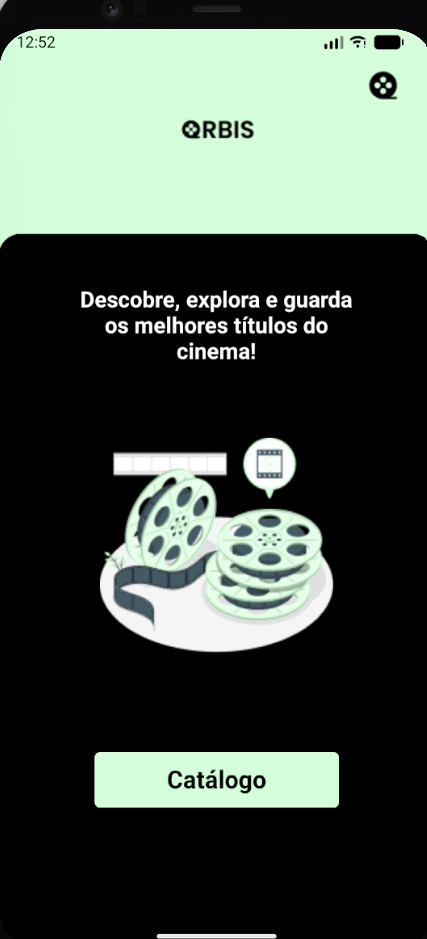
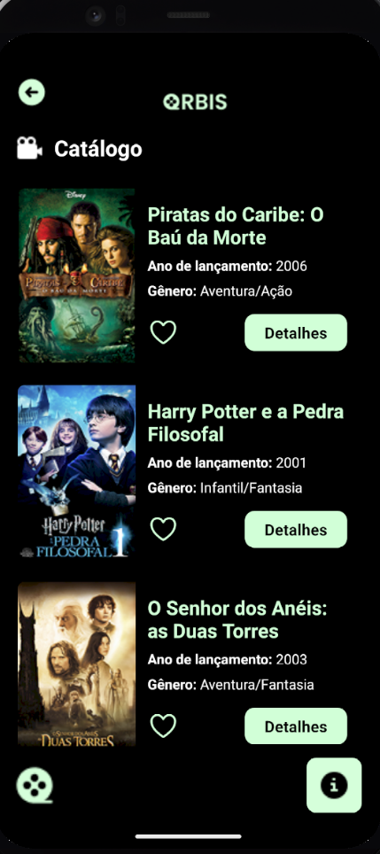
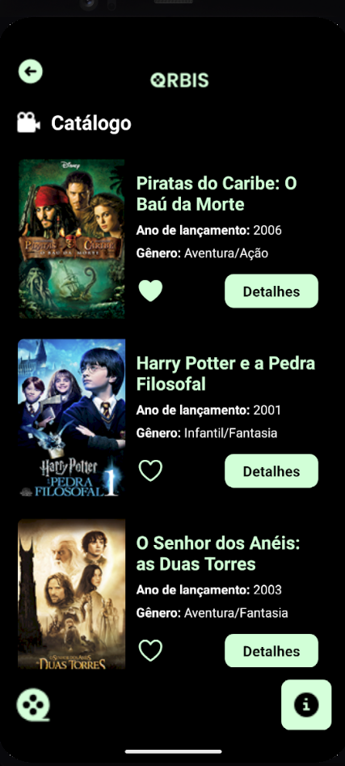
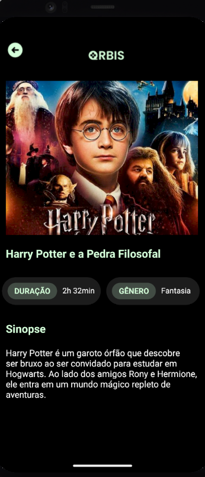
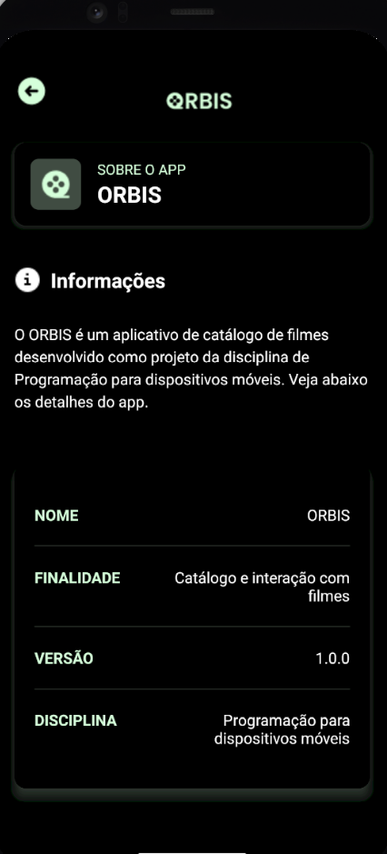

# ORBIS — Catálogo de Filmes

## Informações

**Nome:** Geovanna Pereira da Silva  
**RA:** 2991392513013  
**Disciplina:** Programação para Dispositivos Móveis I  
**Aplicativo:** ORBIS

## Descrição

O ORBIS é uma aplicação mobile desenvolvida para apresentar e explorar um catálogo de filmes. O aplicativo permite que o usuário visualize diferentes títulos, consulte informações como gênero e ano de lançamento, favorite filmes e acesse uma tela com detalhes de cada obra.

O projeto foi desenvolvido utilizando React Native com Expo, aplicando conceitos de componentes, Props, StyleSheet, Flexbox, Pressable, useState, useEffect e navegação entre telas com Expo Router.

## Funcionalidades

- Visualização da tela inicial do aplicativo;
- Acesso ao catálogo de filmes;
- Catálogo com 6 filmes;
- Exibição de título, imagem, gênero e ano de lançamento;
- Sistema de favoritos;
- Visualização dos detalhes de cada filme;
- Tela Sobre com informações do aplicativo;
- Navegação entre as telas;
- Componentes reutilizáveis.

## Tecnologias utilizadas

- React Native
- Expo
- TypeScript
- Expo Router

## Estrutura do projeto

```text
ORBIS/
├── app/
│   ├── _layout.tsx
│   ├── index.tsx
│   ├── catalogo-filmes.tsx
│   ├── detalhes.tsx
│   └── sobre.tsx
│
├── components/
│   ├── CardFilme.tsx
│   └── Header.tsx
│
├── assets/
│   └── images/
│
├── package.json
└── README.md
```

## Componentes reutilizáveis

### CardFilme

O componente `CardFilme` é responsável por apresentar as informações de cada filme no catálogo. Ele recebe as informações por meio de Props, como:

- Título;
- Ano;
- Gênero;
- Imagem;
- Função para acessar os detalhes.

O componente também possui o sistema de favoritos utilizando `useState`.

### Header

O componente `Header` foi criado para ser reutilizado nas telas do aplicativo que possuem o cabeçalho com o logotipo e o botão de retorno.

Ele é utilizado em diferentes telas, evitando a repetição do mesmo código.

## Navegação

A navegação do aplicativo é realizada utilizando o Expo Router.

O fluxo principal é:

```text
Início
   ↓
Catálogo
   ├──→ Detalhes
   └──→ Sobre
          ↓
        Voltar
```

Ao selecionar um filme no catálogo, o usuário é direcionado para sua tela de detalhes.

## Favoritos

O sistema de favoritos utiliza o hook `useState` para controlar se um filme está ou não marcado como favorito.

Ao pressionar o botão de favorito, o estado é alterado e o ícone é atualizado visualmente.

## Pressable

Os elementos interativos do aplicativo utilizam `Pressable`, permitindo tratar os eventos de toque e aplicar alterações visuais durante o pressionamento.

## useEffect

O `useEffect` é utilizado no catálogo para executar uma ação quando a tela é carregada, registrando uma mensagem no console para indicar que o catálogo foi carregado.

## Como executar o projeto

### 1. Instalar as dependências

```bash
npm install
```

### 2. Iniciar o Expo

```bash
npx expo start
```

Após iniciar o projeto, utilize o QR Code ou uma das opções disponibilizadas pelo Expo para executar o aplicativo.

## Capturas de tela

### Tela inicial



### Catálogo



### Favoritos



### Detalhes



### Sobre


